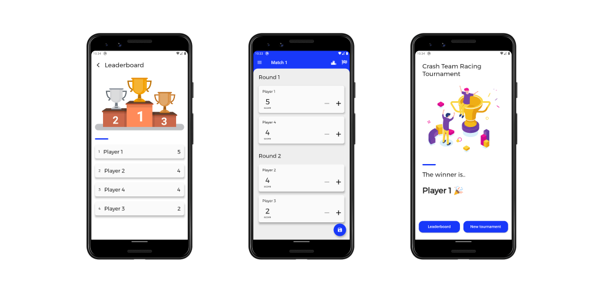

<div align="center">
  
  <h1>Friends Tournament</h1>
</div>

Friends Tournament is the perfect manager for tournaments with your friends. You can use Friends Tournament to generate videogames tournament, sports tournament, board games tournament, whatever type of tournament do you want.

<div align="center">
  
</div>

### Tournament Creation 🎲

All you need to do is to provide the number of players, the number of matches and the numbers of player that can play at the same time. That's all! Friends Tournament will then generate the matches and the rounds for you.

### Tournament Management 🏆

Keep the score of each player and a leaderboard will be generated automatically.

## Download 📦

Friends Tournament is available for Android and iOS.

<div align="center"><a href="https://play.google.com/store/apps/details?id=com.prof.friends_tournament"></a></div>
<div align="center"><a href="https://apps.apple.com/it/app/friends-tournament/id6447518129?l=en"></a></div>


## Translating 🌍

Friends Tournament currently supports Italian, English, Spanish, French and Portuguese. 
If you want to help Friends Tournament becoming international, I will more than happy.

To add a new translation just add a pull request with a new `json` file in the `lang` folder and a new store description in the `store_assets` folder.

## Acknowledgments 🌸

- All the vectors and the illustrations used in the app are provided by [freepik.com](https://it.freepik.com/foto-vettori-gratuito/design)
- Thanks to [@giansegato](https://giansegato.com/) for design reviews and many other advices.

## License 📄

```
   Copyright 2019-2020 Marco Gomiero

   Licensed under the Apache License, Version 2.0 (the "License");
   you may not use this file except in compliance with the License.
   You may obtain a copy of the License at

       http://www.apache.org/licenses/LICENSE-2.0

   Unless required by applicable law or agreed to in writing, software
   distributed under the License is distributed on an "AS IS" BASIS,
   WITHOUT WARRANTIES OR CONDITIONS OF ANY KIND, either express or implied.
   See the License for the specific language governing permissions and
   limitations under the License.
```